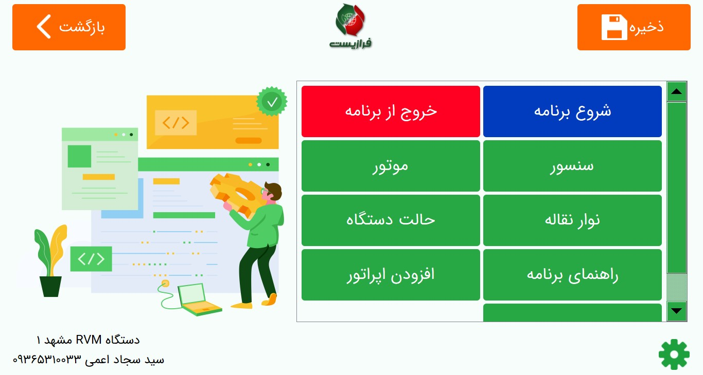

# raspberrypi-app
App for smart recycle waste bottles
{:width="500px"}
## Requirements
* Raspberry Pi OS (32-bit)
* Python 3.7
* Required
  * TensorFlow Lite
  * PySide2
  * scipy
  * gpiozero
  * qrcode
  * sqlite3
  * escpos
  * qtquick
## Hardware requirements
 * Raspberry Pi 4 (model B - 4GB RAM)
 * Raspberry Pi NoIR Camera V2
## Status
This project is early in development and does not yet have a stable API.
  
